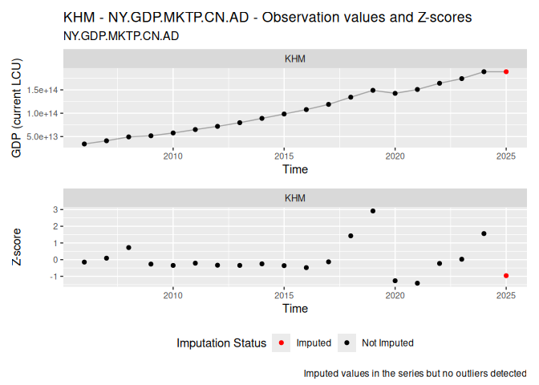
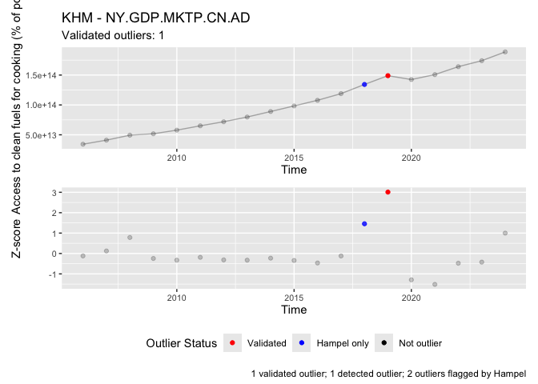

<!-- README.md is generated from README.Rmd. Please edit that file -->

# macroanomaly

<!-- badges: start -->

[](https://github.com/lucianopv/macroanomaly/actions/workflows/R-CMD-check.yaml)
<!-- badges: end -->

The goal of `macroanomaly` is to detect and validate anomalies in
macroeconomic time series data using various statistical methods. This
package provides a complete workflow for:

- **Normalizing** time series data (detrending, imputing missing values)
- **Detecting** outliers using multiple methods (Z-score, isolation
  forests, CAPA, tsoutliers, outlier trees)
- **Validating** detected anomalies to reduce false positives (Hampel
  filter)

The package is particularly designed for macroeconomic indicators and
handles panel data across countries and time periods.

## Installation

You can install the development version of macroanomaly from
[GitHub](https://github.com/) with:

``` r
# install.packages("pak")
# pak::pak("lucianopv/macroanomaly")
# install.packages("devtools")
devtools::install_github("lucianopv/macroanomaly", dependencies = TRUE, build_vignettes = TRUE)
# Alternatively, you can use remotes package
# install.packages("remotes")
# remotes::install_github("lucianopv/macroanomaly", dependencies = TRUE, build_vignettes = TRUE)
```

## Workflow

The package follows a simple three-step pipeline:

1.  **`normalize()`** - Prepare time series data (detrend, impute,
    normalize)
2.  **`detect()`** - Identify anomalies using one or multiple detection
    methods
3.  **`validate()`** - Filter false positives using secondary validation
    methods

## Example

This example uses the World Bank Development Indicators (WDI) dataset to
demonstrate the complete workflow: data preparation, normalization,
anomaly detection, and validation.

``` r
library(macroanomaly)
library(collapse)

# Load the WDI data
wdi_download(.path = tempdir()) |>
  pivot(
    ids = c("Year", "Country.Name", "Country.Code"),
    how = "longer",
    names = list("Indicator.Code", "Indicator.Value")
    ) |>
  fsubset(Indicator.Code %in% c("EG.CFT.ACCS.ZS", "NY.GDP.MKTP.CN.AD") & Year > 2005) |>
  fsubset(!Country.Code %in% c("ABW", "ASM", "BGR", "BMU", "CHI", "CUW", "CYM",
                               "FRO", "GIB", "GRL", "GUM", "HKG", "IMN", "INX",
                               "LBN", "LBY", "LIE", "MAC", "MAF", "MNP", "NCL",
                               "PRI", "PSE", "PYF", "SXM", "TCA", "VGB", "VIR", "XKX", # No data in these countries
                                 "AFE", "AFW", "ARB", "CEB", "CSS", "EAP", "EAR", "EAS", "ECA", "ECS", "EMU", "EUU",
                                 "FCS", "HIC", "HPC", "IBD", "IBT", "IDA", "IDB", "IDX", "LAC", "LCN", "LDC", "LIC",
                                 "LMC", "LMY", "LTE", "MEA", "MIC", "MNA", "NAC", "OED", "OSS", "PRE", "PRK", "PSS",
                                 "PST", "SAS", "SSA", "SSF", "SST", "TEA", "TEC", "TLA", "TMN", "TSA", "TSS", "UMC", "WLD" # Aggregates without data
                               )) -> wdi_data_long_subset_filtered
#> [1] "File already exists in /var/folders/tq/5m_rk2j94s3b6vt72t08368r0000gn/T//RtmpyKKiAl/WDICSV.csv. No new download."

# Normalize the data
# Normalize the World Bank data
wdi_data_long_subset_filtered |>
  normalize(.value_col= "Indicator.Value",
            .country_col = c("Country.Code", "Country.Name"),
            .indicator_col = "Indicator.Code",
            .time_col = "Year",
            .detrend = TRUE,
            .impute = TRUE
            ) -> wdi_data_long_subset_normalized
```

Let’s plot the normalized data to visualize the original values and the
normalized version of the data which was detrended and imputed (if
missing):

``` r
plot(wdi_data_long_subset_normalized)
```


### Detect Anomalies

We can detect anomalies using multiple methods simultaneously. Each
method flags potential outliers, and the results are combined with a
total count:

``` r
# Detect anomalies using multiple methods
wdi_data_long_subset_normalized |>
  detect(.method = c("tsoutlier", "isotree", "capa"), 
         .args = list(capa = c(.min_seg_len = 3), 
                      isotree = c(.threshold = 0.7))) -> wdi_data_long_detected

# Plot the results for a specific country and indicator
plot(wdi_data_long_detected, 
     country = "KHM", 
     indicator = "NY.GDP.MKTP.CN.AD",
     .total_threshold = 2,
     x.lab = "Time", 
     y.lab = "Access to clean fuels for cooking (% of pop.)")
```



### Validate Results

To reduce false positives, we can validate the detected anomalies using
the Hampel filter. This secondary filter confirms which outliers are
likely genuine anomalies:

``` r
# Validate detected anomalies using Hampel filter
wdi_data_long_detected |>
  validate(.method = "hampel") -> wdi_data_long_validated

# Plot validated results showing different outlier categories
plot(wdi_data_long_validated, 
     country = "KHM", 
     indicator = "NY.GDP.MKTP.CN.AD",
     x.lab = "Time", 
     y.lab = "Access to clean fuels for cooking (% of pop.)")
```



The validation plot shows: - **Validated** (red): Confirmed outliers by
both detection and validation methods - **Detected only** (orange):
Potential false positives - **Hampel only** (blue): Additional anomalies
caught by validation - **Not outlier** (faded): Normal observations

## Learn More

For detailed examples and explanations of all methods, see
`vignette("Macroanomaly")`.
