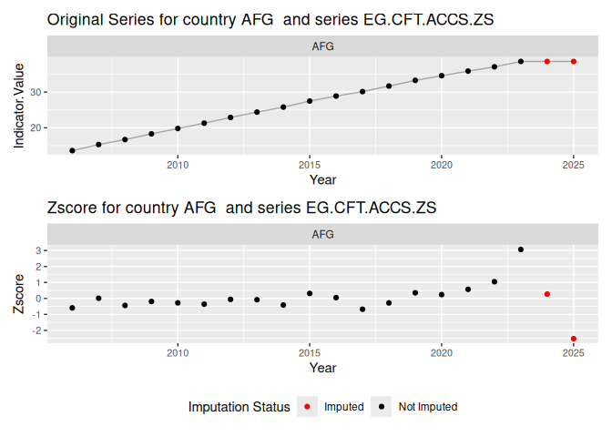
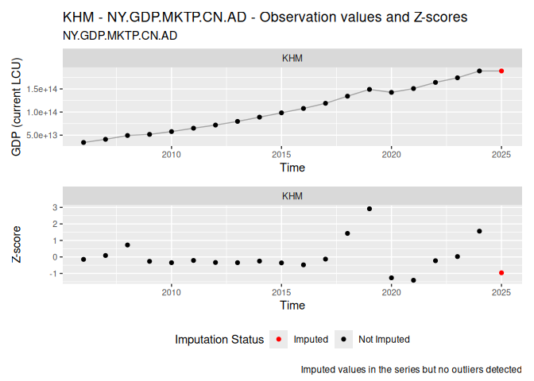

<!-- README.md is generated from README.Rmd. Please edit that file -->

# macroanomaly

<!-- badges: start -->

[](https://github.com/lucianopv/macroanomaly/actions/workflows/R-CMD-check.yaml)
<!-- badges: end -->

The goal of `macroanomaly` is to detect anomalies in macroeconomic data
using various statistical methods. The package is particularly designed
for macroeconomic indicators and handles panel data across countries and
time periods. The workflow is:

1.  **`normalize()`** — Prepare time series data: detrend, impute
    missing values, and compute Z-scores.
2.  **`detect()`** — Identify anomalies using one or more methods:
    Z-score, isolation forests (`isotree`), outlier trees
    (`outliertree`), IQR-based detection (`tsoutlier`), point and
    collective anomalies (`capa`), and the Hampel filter (`hampel`).

## Installation

You can install the development version of macroanomaly from
[GitHub](https://github.com/) with:

``` rh
# install.packages("pak")
# pak::pak("lucianopv/macroanomaly")
# install.packages("devtools")
devtools::install_github("lucianopv/macroanomaly", dependencies = TRUE, build_vignettes = TRUE)
# Alternatively, you can use remotes package
# install.packages("remotes")
# remotes::install_github("lucianopv/macroanomaly", dependencies = TRUE, build_vignettes = TRUE)
```

## Example

This example uses the World Bank Development Indicators (WDI) dataset to
demonstrate the workflow: data preparation, normalization, and anomaly
detection.

``` r
library(macroanomaly)
library(collapse)

# Load the WDI data
wdi_download(.path = tempdir()) |>
  pivot(
    ids = c("Year", "Country.Name", "Country.Code"),
    how = "longer",
    names = list("Indicator.Code", "Indicator.Value")
    ) |>
  fsubset(Indicator.Code %in% c("EG.CFT.ACCS.ZS", "NY.GDP.MKTP.CN.AD") & Year > 2005) |>
  fsubset(!Country.Code %in% c("ABW", "ASM", "BGR", "BMU", "CHI", "CUW", "CYM",
                               "FRO", "GIB", "GRL", "GUM", "HKG", "IMN", "INX",
                               "LBN", "LBY", "LIE", "MAC", "MAF", "MNP", "NCL",
                               "PRI", "PSE", "PYF", "SXM", "TCA", "VGB", "VIR", "XKX", # No data in these countries
                                 "AFE", "AFW", "ARB", "CEB", "CSS", "EAP", "EAR", "EAS", "ECA", "ECS", "EMU", "EUU",
                                 "FCS", "HIC", "HPC", "IBD", "IBT", "IDA", "IDB", "IDX", "LAC", "LCN", "LDC", "LIC",
                                 "LMC", "LMY", "LTE", "MEA", "MIC", "MNA", "NAC", "OED", "OSS", "PRE", "PRK", "PSS",
                                 "PST", "SAS", "SSA", "SSF", "SST", "TEA", "TEC", "TLA", "TMN", "TSA", "TSS", "UMC", "WLD" # Aggregates without data
                               )) -> wdi_data_long_subset_filtered
#> [1] "File already exists in /tmp/Rtmphc2p5E/WDICSV.csv. No new download."

# Normalize the data
# Normalize the World Bank data
wdi_data_long_subset_filtered |>
  normalize(.value_col= "Indicator.Value",
            .country_col = c("Country.Code", "Country.Name"),
            .indicator_col = "Indicator.Code",
            .time_col = "Year",
            .detrend = TRUE,
            .impute = TRUE
            ) -> wdi_data_long_subset_normalized
```

Let’s plot the normalized data to visualize the original values and the
normalized version of the data which was detrended and imputed (if
missing):

``` r
plot(wdi_data_long_subset_normalized)
```



### Detect Anomalies

Multiple methods can be combined in a single `detect()` call. Each
method flags potential outliers independently, and the
`outlier_indicator_total` column counts how many methods agreed on each
observation:

``` r
# Detect anomalies using multiple methods
wdi_data_long_subset_normalized |>
  detect(.method = c("tsoutlier", "isotree", "capa", "hampel"), 
         .args = list(capa = c(.min_seg_len = 3), 
                      isotree = c(.threshold = 0.7))) -> wdi_data_long_detected

# Plot the results for a specific country and indicator
plot(wdi_data_long_detected, 
     country = "KHM", 
     indicator = "NY.GDP.MKTP.CN.AD",
     .total_threshold = 2,
     x.lab = "Time", 
     y.lab = "GDP (current LCU)")
```



## Learn More

For detailed examples and explanations of all methods, see
`vignette("Macroanomaly")`.
