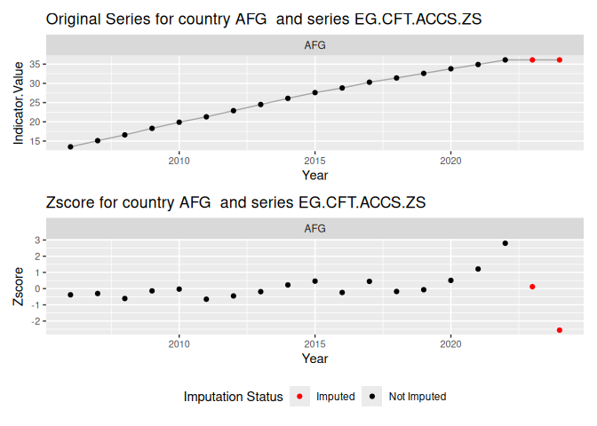
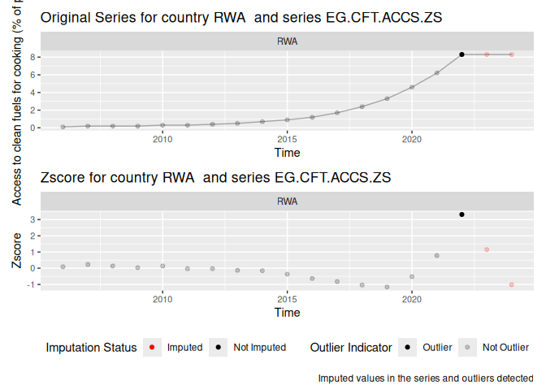

<!-- README.md is generated from README.Rmd. Please edit that file -->

# macroanomaly

<!-- badges: start -->

[](https://github.com/lucianopv/macroanomaly/actions/workflows/R-CMD-check.yaml)
<!-- badges: end -->

The goal of `macroanomaly` is to detect anomalies in macroeconomic data
using various statistical methods. This package provides tools for
identifying outliers in time series data, particularly focusing on
macroeconomic indicators. The package includes methods such as Z-score
normalization, isolation forests, outlier trees, and time series outlier
detection.

## Installation

You can install the development version of macroanomaly from
[GitHub](https://github.com/) with:

``` r
# install.packages("pak")
# pak::pak("lucianopv/macroanomaly")
# install.packages("devtools")
devtools::install_github("lucianopv/macroanomaly", dependencies = TRUE, build_vignettes = TRUE)
# Alternatively, you can use remotes package
# install.packages("remotes")
# remotes::install_github("lucianopv/macroanomaly", dependencies = TRUE, build_vignettes = TRUE)
```

## Example

A simple example using the World Bank Development Indicators (WDI)
dataset is provided below. The example demonstrates how to download the
data, normalize it, and detect anomalies using multiple methods.

``` r
library(macroanomaly)
library(collapse)

# Load the WDI data
wdi_download(.path = tempdir()) |>
  pivot(
    ids = c("Year", "Country.Name", "Country.Code"),
    how = "longer",
    names = list("Indicator.Code", "Indicator.Value")
    ) |>
  fsubset(Indicator.Code %in% c("EG.CFT.ACCS.ZS", "NY.GDP.MKTP.CN.AD") & Year > 2005) |>
  fsubset(!Country.Code %in% c("ABW", "ASM", "BGR", "BMU", "CHI", "CUW", "CYM",
                               "FRO", "GIB", "GRL", "GUM", "HKG", "IMN", "INX",
                               "LBN", "LBY", "LIE", "MAC", "MAF", "MNP", "NCL",
                               "PRI", "PSE", "PYF", "SXM", "TCA", "VGB", "VIR", "XKX", # No data in these countries
                                 "AFE", "AFW", "ARB", "CEB", "CSS", "EAP", "EAR", "EAS", "ECA", "ECS", "EMU", "EUU",
                                 "FCS", "HIC", "HPC", "IBD", "IBT", "IDA", "IDB", "IDX", "LAC", "LCN", "LDC", "LIC",
                                 "LMC", "LMY", "LTE", "MEA", "MIC", "MNA", "NAC", "OED", "OSS", "PRE", "PRK", "PSS",
                                 "PST", "SAS", "SSA", "SSF", "SST", "TEA", "TEC", "TLA", "TMN", "TSA", "TSS", "UMC", "WLD" # Aggregates without data
                               )) -> wdi_data_long_subset_filtered
#> [1] "Checking if file exists and downloading..."

# Normalize the data
# Normalize the World Bank data
wdi_data_long_subset_filtered |>
  normalize(.value_col= "Indicator.Value",
            .country_col = c("Country.Code", "Country.Name"),
            .indicator_col = "Indicator.Code",
            .time_col = "Year",
            .detrend = TRUE,
            .impute = TRUE
            ) -> wdi_data_long_subset_normalized
```

Let’s plot the normalized data to visualize the original values and the
normalized version of the data which was detrended and imputed (if
missing):

``` r
plot(wdi_data_long_subset_normalized)
```



Then we can detect anomalies in the normalized data using multiple
methods, such as Z-score, isolation forest, and IQR outlier detection:

``` r
# Detect anomalies in the World Bank data using multiple methods
wdi_data_long_subset_normalized |>
  detect(.method = c("tsoutlier", "isotree", "capa"), .args = list(capa = c(.min_seg_len = 3), isotree = c(.threshold = 0.7))) -> wdi_data_long_multiple_methods

# Plot the results for a specific country and indicator
plot(wdi_data_long_multiple_methods, country = "ECU", indicator = "EG.CFT.ACCS.ZS",.total_threshold = 2,
     x.lab = "Time", y.lab = "Access to clean fuels for cooking (% of pop.)")
```


